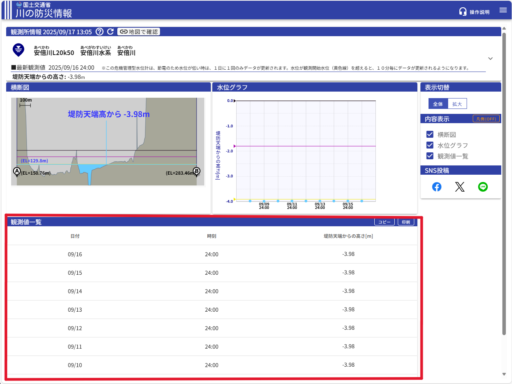

# scraping

国土交通省　川の防災情報（https://www.river.go.jp/index）から水位データを取得するプログラム。

## 開発環境

・OS：windows11

・Python 3.10.11

## フォルダ構成

result：出力ファイル保存先

script：スクリプト保存先

## ファイル構成

stderr.log：エラーログの出力

stdout.log：正常ログの出力

wl.json：Web上で取得したファイル

script/const.py：設定用スクリプト

script/fetch.py：web上のデータを取得しファイルに保存するスクリプト

script/run.py：実行用スクリプト
